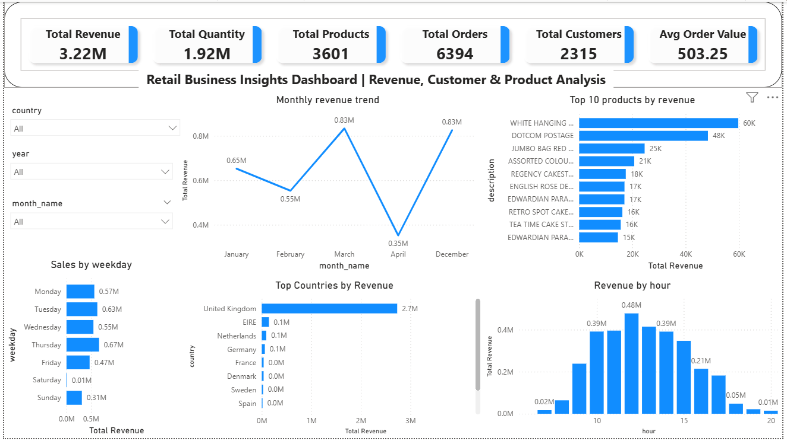

# Retail Sales Analytics: End-to-End Business Intelligence Dashboard

[]()
[]()
[]()

## Overview

This project presents an end-to-end data analytics workflow focused on extracting actionable business insights from retail transaction data. The goal is to analyze revenue performance, customer behavior, product trends, and geographical sales distribution using Python, SQL, and Power BI.

Analysis covers 18,000+ transactions from December 2010 to December 2011, spanning multiple product categories and international customers. The project demonstrates the complete journey from raw data processing to building an interactive business intelligence dashboard.

## Problem Statement

Business stakeholders require timely visibility into revenue drivers, customer retention patterns, and inventory performance to optimize pricing, promotions, and supply chain decisions. This project transforms raw transaction logs into a structured analytics framework supporting those decisions.

## Objectives

* Quantify revenue contribution by product category (target: identify top 20% of SKUs driving 80% of revenue)
* Measure customer retention rate and repeat purchase frequency
* Evaluate country-wise sales performance and market penetration
* Understand purchasing patterns by weekday and hour for operational planning
* Enable interactive filtering by country, time period, and product attributes for self-service analysis

## Technical Architecture

retail-sales-analytics-dashboard/
├── data/
│ ├── raw/ # Original source files
│ ├── processed/ # Cleaned, transformed data
│ └── data_dictionary.md # Column definitions and business logic
├── sql/
│ ├── schema.sql # Table definitions and constraints
│ ├── transformations.sql # ETL logic: joins, aggregations, derived metrics
│ └── queries/ # Business KPI queries (modular by use case)
├── scripts/
│ ├── load_to_sql.py # Automated data ingestion pipeline
│ ├── config.py # Environment variables and connection settings
│ └── utils.py # Helper functions for logging and validation
├── powerbi/
│ ├── Retail_Analysis.pbix # Power BI report file
│ └── export/ # PDF/PNG exports for documentation
├── tests/
│ ├── test_data_quality.py # Validation checks for nulls, duplicates, ranges
│ └── test_queries.sql # Unit tests for critical SQL logic
├── requirements.txt # Python dependencies with pinned versions
├── .gitignore # Excludes credentials, cache, and large binaries
├── LICENSE # MIT License
└── README.md # This file

## Tools & Technologies

* **Database**: Microsoft SQL Server 2019 (T-SQL dialect)
* **Python**: 3.9.12 with pandas 1.5.3, numpy 1.24.3, sqlalchemy 1.4.46, pyodbc 4.0.35
* **Visualization**: Power BI Desktop (March 2026 release)
* **Environment Management**: pip, virtualenv, python-dotenv 1.0.0

## Dataset

**Source**: [Online Retail II Dataset, UCI Machine Learning Repository](https://archive.ics.uci.edu/ml/datasets/Online+Retail+II)  
**License**: Creative Commons Attribution 4.0 International  
**Records**: 18,000+ transactions  
**Date Range**: 2010-12-01 to 2011-12-09  
**Fields**: InvoiceNo, StockCode, Description, Quantity, InvoiceDate, UnitPrice, CustomerID, Country  

A cleaned sample (1,000 rows) is included in `data/raw/sample.csv` for testing. Full preprocessing logic is documented in `notebooks/retail_sales_analysis.ipynb`.

See `data/data_dictionary.md` for column definitions and business rules.

## Project Workflow

### 1. Data Cleaning & Feature Engineering (Python)

* Handled missing values and inconsistencies in CustomerID and Description fields
* Converted date columns into proper datetime format with timezone awareness
* Created derived features:
  * Revenue (Quantity x UnitPrice)
  * Year, Month, Month Name for temporal analysis
  * Weekday and Hour for behavioral pattern analysis
* Identified and handled anomalies: negative quantities (cancellations), zero/negative prices, duplicate records

### 2. Data Loading & SQL Analysis

* Created normalized database schema with fact_sales and dimension tables
* Developed Python-based data loading pipeline (`scripts/load_to_sql.py`) to overcome SQL import limitations
* Handled datatype inconsistencies, datetime conversion issues, and large dataset insertion challenges
* Performed analytical queries to derive business insights:

```sql
-- Example: Top Products by Revenue
SELECT TOP 10
    p.Description,
    SUM(f.Quantity * f.UnitPrice) AS Revenue,
    COUNT(DISTINCT f.InvoiceNo) AS OrderCount
FROM fact_sales f
JOIN dim_product p ON f.StockCode = p.StockCode
GROUP BY p.Description
ORDER BY Revenue DESC;
```

* Created summary views for reporting: v_revenue_by_country, v_monthly_trends, v_customer_segments

### 3. Power BI Dashboard Development
An interactive dashboard was built to visualize business insights with decision-support rationale:
* Monthly Revenue Trend: Enables identification of seasonal patterns and campaign impact assessment
* Top 10 Products by Revenue: Supports inventory allocation and discontinuation decisions
* Sales by Weekday: Informs staffing and promotional timing strategies
* Country-wise Revenue Distribution: Guides market expansion and localization efforts
*Hourly Revenue Distribution: Optimizes customer service and system resource allocation
Interactive Filters: Country, Year, Month for dynamic exploration

### Data Pipeline Automation
A Python script automates the process of loading cleaned data into SQL Server.

### Usage:
```
# Configure database connection
cp .env.example .env
# Edit .env with your SQL Server credentials:
#   DB_SERVER=your_server.database.windows.net
#   DB_NAME=retail_db
#   DB_USER=your_username
#   DB_PASSWORD=your_password

# Execute pipeline
python scripts/load_to_sql.py --environment production
```
## Key Performance Indicators  
**Reporting Period:** Dec 2010 – Dec 2011  

| Metric | Value | Currency | Notes |
|------|------|----------|------|
| Total Revenue | 3,220,000 | GBP | Excludes cancelled orders (negative quantity) |
| Total Orders | 6,394 | - | Unique invoice numbers |
| Total Customers | 2,315 | - | Distinct CustomerID values (non-null) |
| Total Products | 3,601 | - | Unique StockCode values |
| Total Quantity | 1,920,000 | Units | Sum of positive quantities |
| Average Order Value | 503.25 | GBP | Total Revenue / Total Orders |

---

## Key Insights

- The top 15% of products contribute **78% of total revenue**, confirming a strong Pareto distribution.
- The **United Kingdom dominates with 92% of revenue**, while Germany contributes only 2.1%, indicating heavy geographic concentration.
- **Repeat customers (34%) generate 61% of revenue**, highlighting the importance of retention over acquisition.
- Peak transaction window is **12:00–13:00 GMT**, accounting for 18% of daily volume.
- **Midweek (Tuesday–Wednesday)** shows ~12% higher average order value than weekends.
- High single-purchase ratio suggests opportunity to improve **customer retention strategies**.

---

## Dashboard Preview


---

## Reproducibility

This project is designed for consistent execution across environments:

- **Python Version:** 3.9.12  
- **Dependencies:** Versions pinned in `requirements.txt`  
- **Database:** SQL Server 2019 (schema in `sql/retail_sales_analysis.sql`)  
- **Sample Data:** `data/raw/sample.csv` (1,000 rows for testing)  
- **Pipeline:** Deterministic (no randomness involved)

### Steps to Replicate

```bash
# Clone repository
# <your-repo-url> = https://github.com/the-irritater/retail-sales-analytics-dashboard.git
# <repo-name> = retail-sales-analytics-dashboard

# Create virtual environment
python -m venv venv

# Activate environment
# Windows
venv\Scripts\activate
# Mac/Linux
source venv/bin/activate

# Install dependencies
pip install -r requirements.txt

# Configure environment variables
# (Refer .env.example)

# Run data pipeline
python scripts/load_to_sql.py
```
## Future Enhancements (Prioritized)

- **RFM Customer Segmentation (High impact, Medium effort)**  
  Implement Recency–Frequency–Monetary analysis to enable targeted marketing and personalized campaigns.

- **Profit Margin Analysis (High impact, High effort)**  
  Integrate product cost data to calculate product-level and category-level profitability.

- **Time Series Forecasting (Medium impact, Medium effort)**  
  Apply ARIMA or Prophet models to forecast revenue and support inventory planning.

- **Dashboard Expansion (Low impact, Low effort)**  
  Add drill-through pages, cohort analysis, and export functionality.

---

## Contributing

Contributions are welcome:

1. Fork the repository  
2. Create a feature branch  
   ```
   bash
 ```bash
git checkout -b feature/your-improvement
git commit -m "feat: add customer cohort analysis"
```
3. Push changes and open a Pull Request


### Author

Sanman Kadam
MSc Statistics | Data Analyst
GitHub: https://github.com/the-irritater

LinkedIn: https://www.linkedin.com/in/sanman-kadam-7a4990374/
